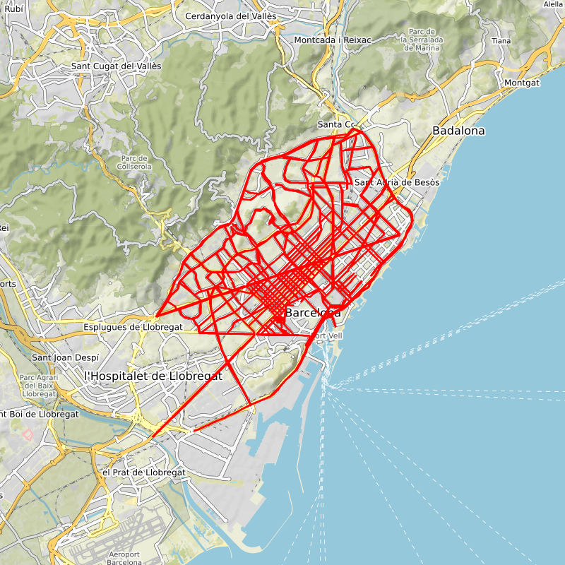
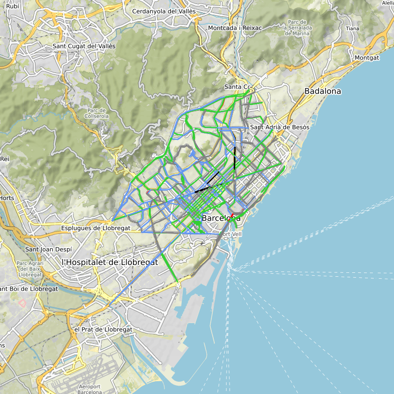
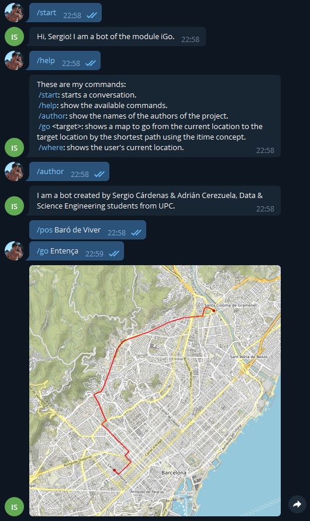

# iGo

If you want to know which is the fastest way to get to your destination don't waste any more time, iGo is your answer. 🚗💨

## Introduction

This document describes the iGo project, corresponding to the GCED AP2 2021 course.

iGo is a module for determining the fastest way to drive from one point in the city of Barcelona to another. To do this, it uses the concept of _itime_, which takes into account different factors such as the length and maximum speed of the road, or the state of congestion of the same at a certain time.

This module uses a Telegram Bot to interact with the user and, using certain established commands, calculate which is the shortest path between two given points.

## Description

iGo consists of two modules:

* `igo.py`: Contains all the code related to downloading data, building graphs, calculating _itime_ and ploting maps.

* `bot.py`: Contains the code related to interacting with the user using a Telegram Bot.

## Main libraries and data sources

To develop this system, contents offered by different libraries have been used. These libraries are included in the `requirements.txt` document. Among the main ones we find:

* [OSMnx](https://geoffboeing.com/2016/11/osmnx-python-street-networks/): Uses the NetworkX library. With OSMnx you can work with Open Street Maps.

* [StaticMap](https://github.com/komoot/staticmap): Allows you to display the OSMnx maps you are working on.

* Python-Telegram-Bot: Connects Python to the Telegram Bot.

The concept of _itime_ uses data from city highways and congestion, so it is necessary to read them before using them. To do this, the Python [csv](https://docs.python.org/3/library/csv.html) module is used, as the data files provided by Barcelona City Council are in csv format.

## igo.py: Module Functionality

The `igo.py` module contains the code and data structures related to obtaining and storing graphs representing maps. The main function of the module is to calculate the shortest path between two points in the city and then generate an image showing the path calculated on the map. When doing this calculation, the concept of _itime_ is used.

The _itime_, or intelligent time, is an attribute that links all available data in order to determine the fastest route between two points.

Among the data available in the Open Data Service of Barcelona City Council, those corresponding to highways and congestion are used.

On the [highways](https://opendata-ajuntament.barcelona.cat/data/ca/dataset/transit-relacio-trams) are the public roads of the city of Barcelona. These are defined by sequences of stretches, of which the start and end coordinates are given. Each highway has a certain maximum speed and length. Therefore, the time it takes in optimal circulation conditions can be calculated. The igo module allows us to plot this highways graph, as we can see in the following image.

In the [congestion](https://opendata-ajuntament.barcelona.cat/data/ca/dataset/trams) information we find the date, the current state and the planned state (15 minutes later). The congestion state is evaluated from 1 (very fluid) to 6 (cut), where 0 means that there are no congestion data in that stretch. The igo module allows us to plot the congestions graph, as we can see in the following image.

Both information will be used in the concept of _itime_, which is responsible of applying the congestion in each stretch to the optimal time. However, the highway information does not match 100% with the OSMnx graph information, just as we do not have congestion information for all stretches of the city. This problem is taken into account when calculating the _itime_ for each stretch, establishing values that we have considered standards for attributes without data.

The module offers functions to download and plot highways and congestion on the map. The second ones changing the color of the marker according to the state of congestion. However, the main functions of the module are responsible of constructing the graph, applying the _itime_ for each edge, and calculating the fastest path between two points from it.

## bot.py: Module Functionality

The `bot.py` module contains the code that supports the operation of the Telegram Bot. It is accessible by different users at the same time.

When we run the bot, it uses the module igo to load all the necessary data to build the intelligent graph with the _itime_ attribute implemented. After that, waits for the user to introduce some of the following commands:

* `/start`: starts a conversation.

* `/help`: shows the available commands.

* `/author`: shows the names of the authors of the project.

* `/go <target>`: shows a map to go from the current location to the target location by the shortest path using the _itime_ concept.

* `/where`: shows the user’s current location.

There is also a hidden command called `/pos <location>` that you can use to fake your position.

The `bot.py` module updates the congestions data every 5 minutes, so the intelligent graph is built again.

## Example

We can see here an example of the usage of the bot.

In this case, we used the `/pos <location>` to fake our position in the map.

## Authors

**Authors:** Sergio Cárdenas & Adrián Cerezuela

_Thanks also to Jordi Petit & Jordi Cortadella for their help_
